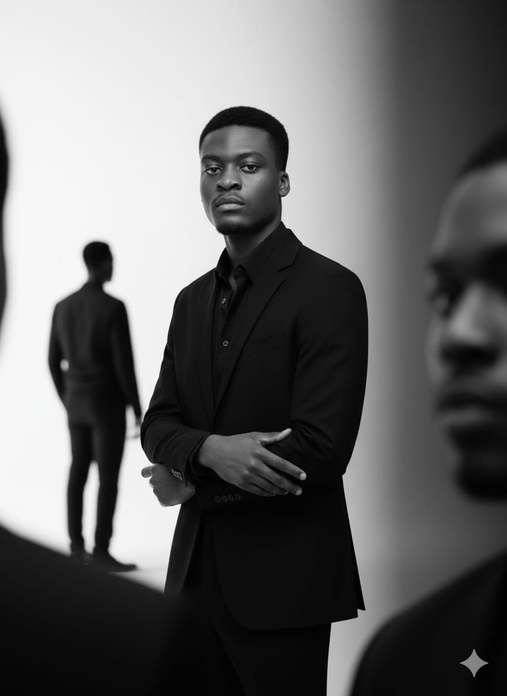

# Benjamin Onyia - Portfolio

A modern, responsive, and dynamic portfolio website showcasing my work as a Fullstack Web Developer with 6+ years of experience.



## 🌟 Features

- **Dynamic Loading Animation**: Elegant 1-second loader on initial page load
- **Responsive Design**: Fully optimized for mobile, tablet, and desktop devices
- **Smooth Animations**: Powered by Framer Motion for seamless transitions
- **Sticky Navigation**: Glassmorphism header with smooth scroll navigation
- **Interactive Project Cards**: Image-based cards with hover effects and status indicators
- **Professional Timeline**: Visual representation of career progression
- **Contact Form**: Functional mailto integration
- **SEO Optimized**: Proper meta tags and semantic HTML structure

## 🛠️ Tech Stack

- **Framework**: [Next.js 16](https://nextjs.org/) (App Router)
- **Language**: [TypeScript](https://www.typescriptlang.org/)
- **Styling**: [Tailwind CSS v4](https://tailwindcss.com/)
- **Animations**: [Framer Motion](https://www.framer.com/motion/)
- **Icons**: [Lucide React](https://lucide.dev/)
- **Font**: [Inter](https://fonts.google.com/specimen/Inter) via Google Fonts

## 🎨 Design System

### Color Palette

- **Primary**: `#414A37` - Dark Green
- **Accent**: `#99744A` - Brown
- **Background**: `#DBC2A6` - Neutral Beige

### Typography

- **Font Family**: Inter (Sans-serif)
- **Weights**: Light (300), Regular (400), Medium (500), Semibold (600), Bold (700)

## 📂 Project Structure

```
my_portfolio/
├── app/
│   ├── globals.css          # Global styles & Tailwind configuration
│   ├── layout.tsx            # Root layout with metadata
│   └── page.tsx              # Main page composition
├── components/
│   ├── About.tsx             # About section
│   ├── Contact.tsx           # Contact form
│   ├── Experience.tsx        # Professional timeline
│   ├── Header.tsx            # Navigation header
│   ├── Hero.tsx              # Hero section
│   ├── Loader.tsx            # Loading animation
│   ├── Projects.tsx          # Project showcase
│   ├── Services.tsx          # Services grid
│   └── TechStack.tsx         # Technical skills
├── public/
│   ├── portfolio_image.jpeg  # Professional photo
│   ├── project-nootrio.png   # Project mockup 1
│   ├── project-dashboard.png # Project mockup 2
│   └── project-quotes.png    # Project mockup 3
└── package.json
```

## 🚀 Getting Started

### Prerequisites

- Node.js 18+ and npm

### Installation

1. Clone the repository:

```bash
git clone https://github.com/classicManCode/Benjamin_portfolio.git
cd Benjamin_portfolio
```

2. Install dependencies:

```bash
npm install
```

3. Run the development server:

```bash
npm run dev
```

4. Open [http://localhost:3000](http://localhost:3000) in your browser.

### Build for Production

```bash
npm run build
npm start
```

## 📱 Sections

1. **Hero**: Introduction with professional photo and CTAs
2. **About**: Personal story and background
3. **Experience**: Career timeline (2017-Present)
4. **Services**: Core competencies (Web Dev, UI/UX, Performance, Responsive)
5. **Tech Stack**: Technologies and tools
6. **Projects**: Featured work with live demos and mockups
7. **Contact**: Email contact form

## 🎯 Projects Featured

### 1. Nootrio Health Food Blog

A comprehensive health food blog with dynamic content and clean design.

- **Tech**: Next.js, Tailwind, TypeScript
- **Live**: [nootrio-health-food-blog.vercel.app](https://nootrio-health-food-blog.vercel.app/)

### 2. Client Management Web App

Dashboard for managing client relationships and project tracking.

- **Tech**: React, Node.js, Express
- **Status**: In Development

### 3. Random Quotes Generator

Interactive quote generation app with social sharing.

- **Tech**: JavaScript, CSS, API
- **Status**: In Development

## 📧 Contact

- **Email**: [legenderyprime@gmail.com](mailto:legenderyprime@gmail.com)
- **GitHub**: [@classicManCode](https://github.com/classicManCode)

## 📄 License

This project is open source and available under the [MIT License](LICENSE).

---

**Built with ❤️ by Benjamin Onyia**
